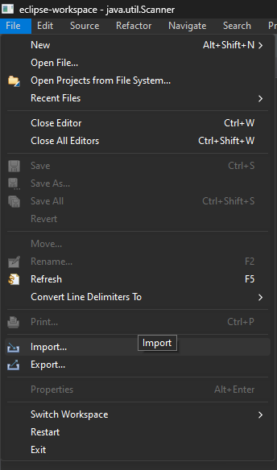
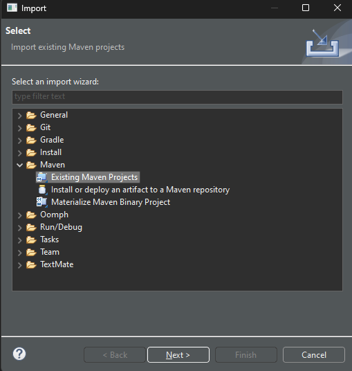
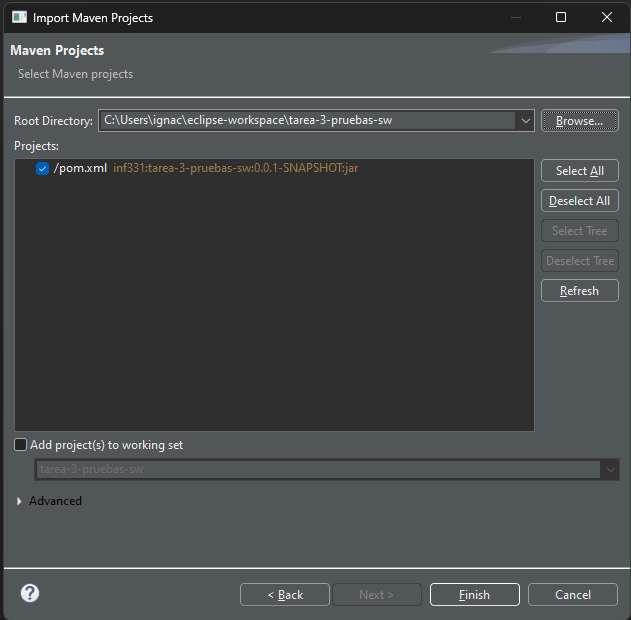
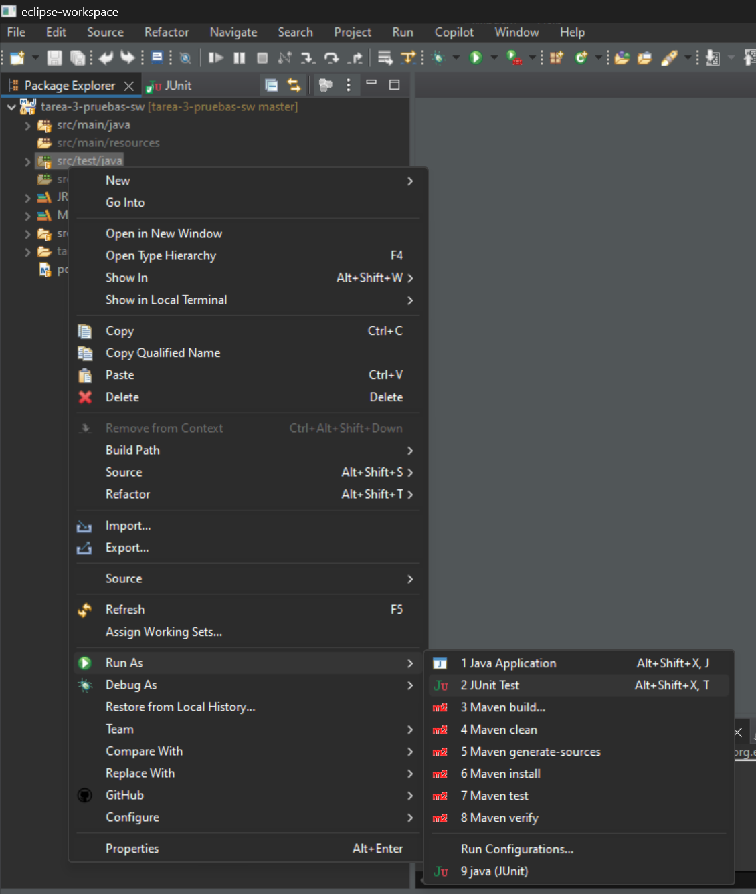
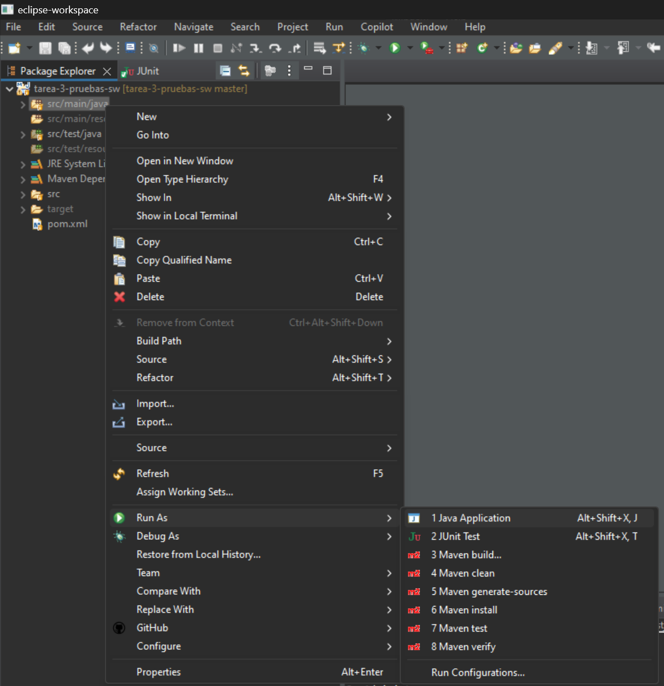
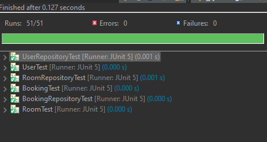

# El programa
## Descripción
Programa de línea de texto en Java para gestionar la reserva de salas de reuniones en una organización. Permite la gestión de salas, usuarios y reservas.

## Diseño del programa
El programa cuenta con 7 clases descritas a continuación:
- Main: Clase principal, en este se encuentra implementado el programa de línea de texto.
- User: Clase que representa a los usuarios.
- Room: Clase que representa a las salas.
- Booking: Clase que representa a las reservas.
- UserRepository: Clase que implementa el CRUD y almacenamiento de los usuarios. 
- RoomRepository: Clase que implementa el CRUD y almacenamiento de las salas.
- BookingRepository: Clase que implementa el CRUD y almacenamiento de reservas.

El programa cuenta con 6 clases de prueba descritas a continuación:
- UserTest: Clase que implementa los test para la clase User.
- RoomTest: Clase que implementa los test para la clase Room.
- BookingTest: Clase que implementa los test para la clase Booking.
- UserRepositoryTest: Clase que implementa los test para la clase UserRepository.
- RoomRepositoryTest: Clase que implementa los test para la clase RoomRepository.
- BookingRepositoryTest: Clase que implementa los test para la clase BookingRepositoryTest.

El proceso de desarrollo del programa se realizó usando TDD.

## Supuestos
- La reserva de la sala es por todo un día, es decir, no puede existir más de una reserva de sala por día.

# Instalación del programa
## Requisitos
- Java
- Maven
- Eclipse

## Pasos
- Clonar repositorio.
- Abrir Eclipse.
- Seleccionar opción File -> Import...

- Seleccionar opción Maven -> Existing Maven Projects

- Seleccionar la opción Browse e ingresa la carpeta dónde clonaste el repositorio, luego selecciona la opción Finish

# Cómo ejecutar los tests
- Dentro del PackageExplorer haz click derecho en src/test/java
- Selecciona la opción Run As -> Junit Test

# Cómo ejecutar el programa
- Dentro del PackageExplorer haz click derecho en src/main/java
- Selecciona la opción Run As -> Java Application

# Reporte de resultados de pruebas unitarias
A continuación se pueden observar los resultados de las pruebas unitarias:

